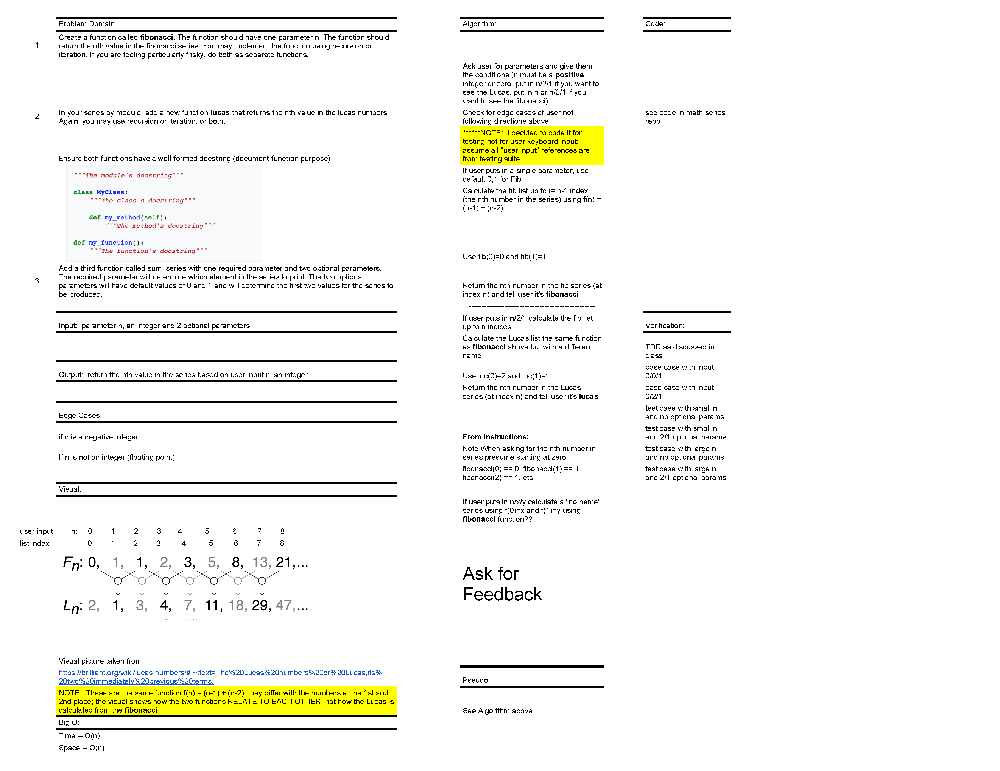

# Math-series

Submission pull request:

__________
#### Developer: Kim Damalas
#### Created: 9 December 2020
#### Version 1.0 
#### Class: seattle-py-401n2
___________
## Description
___________

This module calculates a Fibonacci and/or Lucas series given user input
____________
## Feature Tasks and Requirements
___________

Create a function called `fibonacci`. The function should have one parameter n. The function should return the nth value in the **fibonacci** series. You may implement the function using recursion or iteration. 

Add a function `lucas` that returns the nth value in the **lucas** numbers Again, you may use recursion or iteration, or both. Again, ensure that your function has a well-formed docstring.

Note:  Both the fibonacci series and the lucas numbers are based on an identical formula. 

Add a third function called `sum_series` with one required parameter and two optional parameters. The required parameter will determine which element in the series to print. The two optional parameters will have default values of 0 and 1 and will determine the first two values for the series to be produced.

Calling `sum_series` with no optional parameters will produce numbers from the fibonacci series. Calling it with the optional arguments 2 and 1 will produce values from the lucas numbers. Other values for the optional parameters will produce other series. 

Ensure all function(s) have a well-formed docstring
______________

## Configuration and Technologies
__________

The user must have Python and all associated dependencies installed.  Poetry was used to create math-series project and the program is run by typing  `series.py` in the command line
___________
## Changes
__________

8 Dec: whiteboard with Jae Choi

9 Dec: updated `README.md`; created `series.py` and `test_series.py`

10 Dec: coded, tested, troubleshooted and submitted PR for grading

___________

## Whiteboard
____________

__________

## Testing
________
Testing accomplished using built-in `pytest` and tests coded into `test_series.py`
____________

## Contributing
____________
Intial whiteboard session with Jae Choi

[README structure reference](https://www.makeareadme.com/)

[Python naming conventions](https://www.python.org/dev/peps/pep-0008/)

